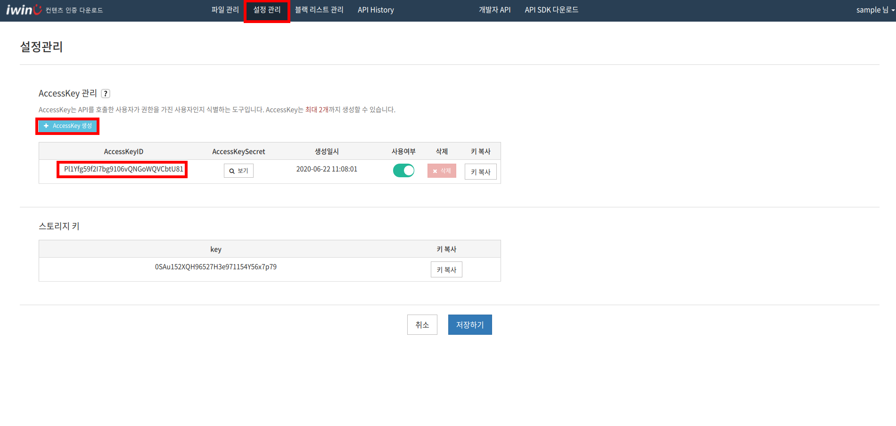
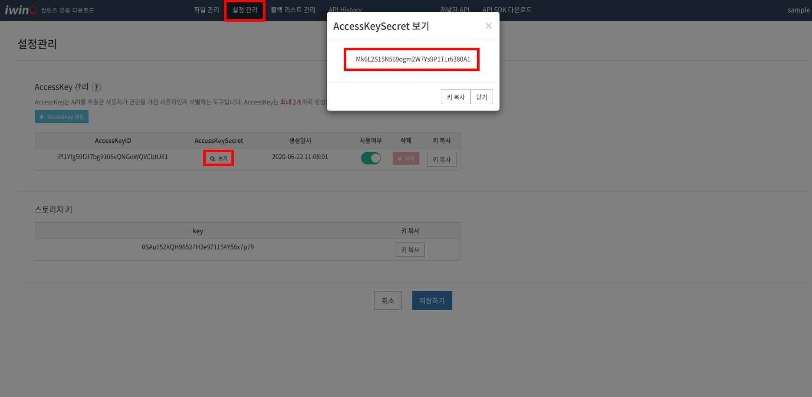
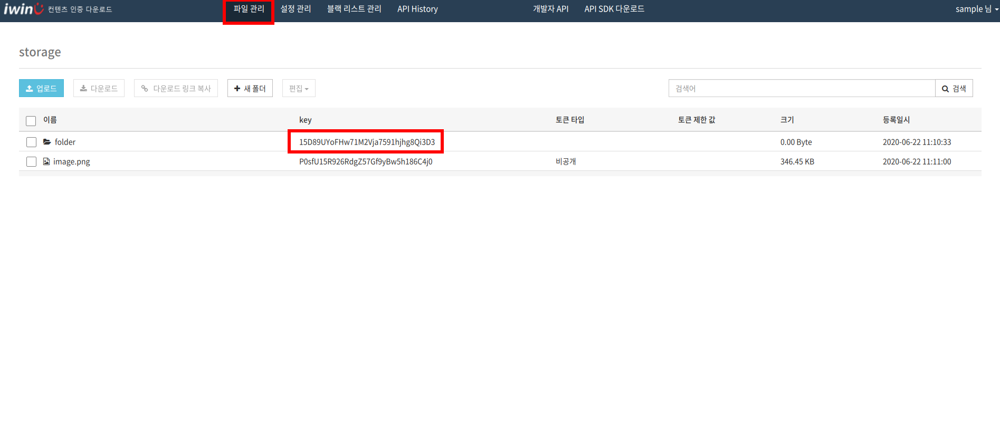

# CAV-API

SDK for iwinv cav-api
SDK를 사용하면 편리하고 안전하게 API 연결을 할 수 있습니다.

## Setting

`setting.php` 파일은 기본 설정 파일입니다.

* 컨텐츠 인증 VOD 서비스의 도메인 `setting.php`의 `apiDomain`의 값으로 설정합니다.
* API 버전을 `setting.php`의 `version`의 값으로 설정합니다.

* 아래 그림과 같이 **콘솔**에서 `설정관리` -> `AccessKey 관리` 에서 accesskey를 생성하며
**accesskey ID** 과 **secret**를 `setting.php`의 `accesskeyId`,`accesskeySecret`로 설정합니다.

<p align="center">

</p>

<p align="center">

</p>

* 아래 그림과 같이 **콘솔**에서 `파일관리` -> 해당폴더의 **folderKey**를 `setting.php`의 `folderKey`로 설정합니다.

<p align="center">

</p>

## Authentication.class.php

**Class**에서 아래와 같이 **Method**를 포함하여 호출해서 사용할 수 있습니다.

* `getToken ()` -> Token 요청 ( `setting.php` 설정필요 )

* `filesListSelect ( $token = '' , $folderKey = '' )` -> 파일 리스트 검색
* `filesSelect ( $token = '' , $filesKey )` -> 파일 상세 검색
* `folderCreate ( $token = '' , $folderKey = '' , $folderName )` -> 폴더 생성
* `foldersSelect ( $token = '' , $action = '' , $folderKey = '' )` -> 폴더 조회
* `filesNameUpdate ( $token = '' , $filesKey , $filesName )` -> 파일 이름 수정
* `filesDelete ( $token = '' , $filesKeys )` -> 파일 삭제 ( 멀티 )
* `tagUpdate ( $token = '' , $filesKey , $tag = '' )` -> 파일 태그 수정

**Token** 는 `getToken ()` 로 생성하며 같은 **Object**에서 저장하고 있으므로
아래와 같이 사용이 가능합니다.
```
$AUTH = new Authentication ( $_API );
$token = $AUTH -> getToken ();
$files1 = $AUTH -> filesListSelect ( $AUTH -> token ) ;
$files2 = $AUTH -> filesListSelect ( $token ) ;
$files3 = $AUTH -> filesListSelect () ;
```

## 버전관리

최신버전은 `v1` 입니다.
`setting.php`의 `version`으로 설정합니다.
